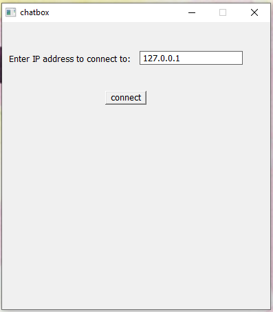
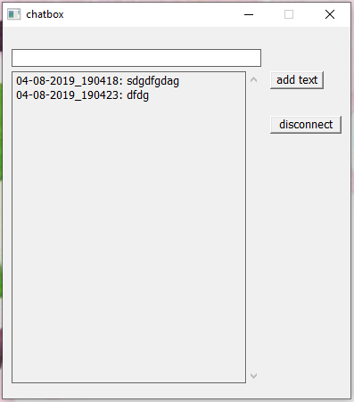
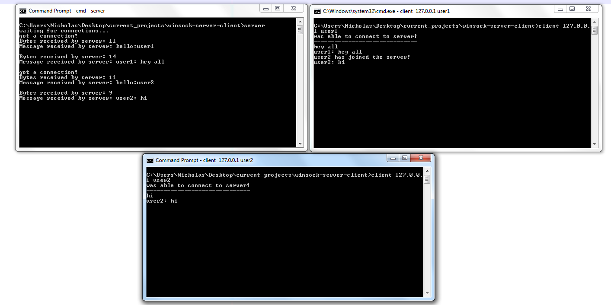

## server and client using WinSock    
    
The server program allows multiple clients to chat with each other by using select(). Any message a client sends to the server gets broadcasted to all connected clients.    
    
The client program has a GUI!    
    
    
    
Not completely functional atm (i.e. no username input right now) but can connect with the server at least!    
    
    